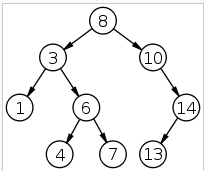
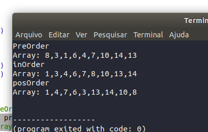

# Arvore Binária 
Essa é uma implementação da estrutura de dados do tipo arvore em JavaScript. 

## Testando 

No arquivo `examples.js` é mostrado como é usado o modulo. 

``` 
const { insert, preOrder, inOrder, posOrder } = require('./tree') 
```

Logo acima é feita a importação das funções necessarias. Abaixo é mostrado mostrado a criação de um objeto para ser passado para a função `insert` que ira inserir os elementos na arvore. 

``` 
const tree = {}

insert(tree, 8)
insert(tree, 3)
insert(tree, 10)
insert(tree, 6)
insert(tree, 4)
insert(tree, 7)
insert(tree, 14)
insert(tree, 13)
insert(tree, 1)

```
Os elementos acima inseridos formam a esttrutura na imagem. 



Três metodos para percorrer a arvore foram importados `preOrder`, `inOrder` e `posOrder`. E cada faz de um jeito como pode ser visto detalhado na lista a seguir.

* `preOrder` ou Pré-Ordem: raiz, esquerda, direita;
* `inOrder` ou Em-Ordem: esquerda, raiz, direita;
* `posOrder` ou Pós-Ordem: esquerda, direita, raiz.

No exemplo a seguir é chamdao o metodo  `inOrder` e  passado a arvore como argumento e o resultado será um `Array` salvo na variavel `resultPre`.

```
let resultPre = preOrder(tree)
console.log(`Array: ${resultPre}`)
```

E o resultado:


